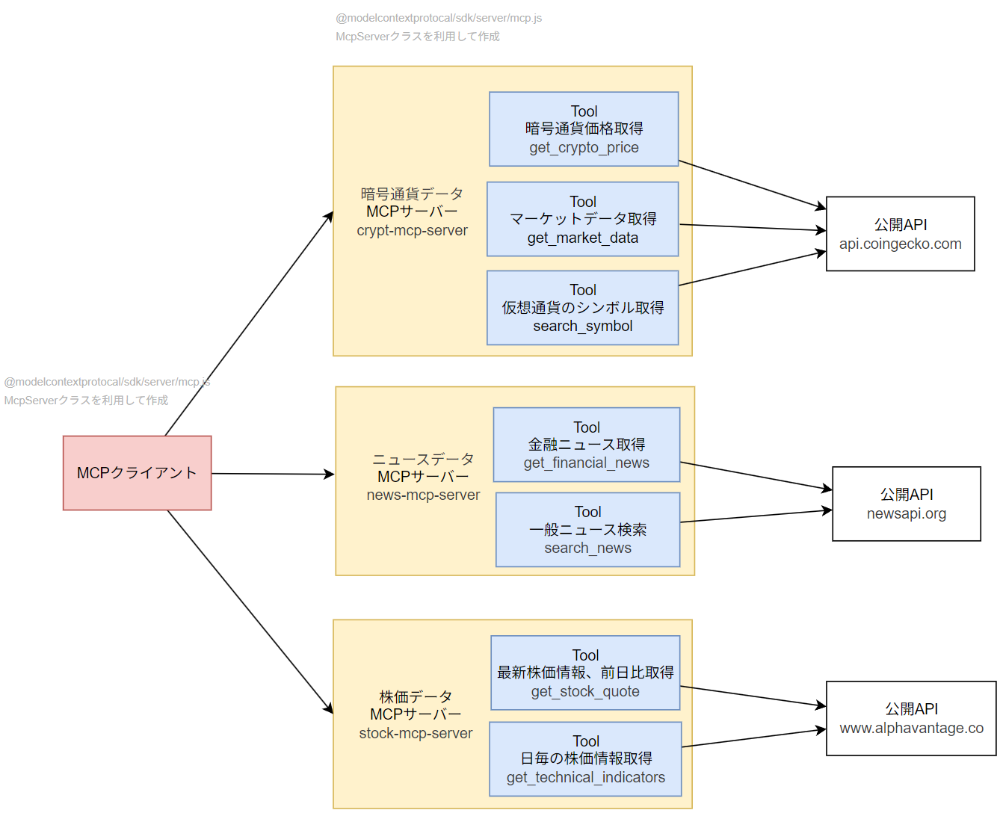

## 概要
公開APIから暗号通貨や株価、ニュースデータを取得して、回答するエージェントです。
MCP理解のために、自作MCPサーバを作ってみました。



## 実装ファイル
- MCPサーバー：
    1. [暗号通貨データMCPサーバー](./src/mcp/crypto-server.ts)
        Tool：get_crypto_price, get_market_data, search_symbol
    2. [ニュースデータMCPサーバー](./src/mcp/news-server.ts)
        Tool: get_financial_news, search_news
    3. [株価データMCPサーバー](./src/mcp/stock-server.ts)
        Tool: get_stock_quote, get_technical_indicates
- MCPクライアント：[./src/mcp-client.ts](./src/mcp-client.ts)
- メインのエントリーポイント:[./src/main.ts](./src/main.ts)

## 利用技術
- [modelcontextprotocol/typescript-sdk](https://github.com/modelcontextprotocol/typescript-sdk)によるMCPクライアント/サーバー実装
- [LangSmith](https://www.langchain.com/langsmith)によるトレーシング
- [ローカルLLM (Ollama)](https://github.com/ollama/ollama)によるモデル呼び出し

## 利用API
無料で利用できるAPIを利用しています。
- [CoinGecko API](https://docs.coingecko.com/v3.0.1/reference/introduction)
- [News API](https://newsapi.org/docs)
- [Alpha Vantage API](https://www.alphavantage.co/documentation/)

## 実行方法

### 1. セットアップ
```bash
npm install
```

`.env.example` をコピーして `.env` を作成

### 2. MCPサーバー起動
```bash
npm run start-mcp-servers
```

### 3. 実行
```bash
npm run dev
```