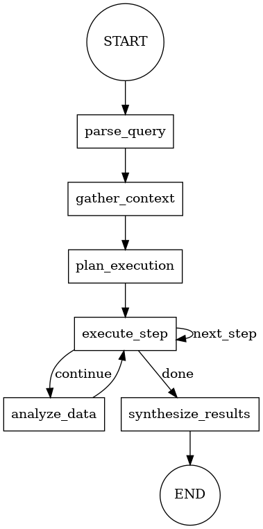

## 概要
公開APIから暗号通貨や株価、ニュースデータを取得して、今後の変動を予測するツールです。
MCPの仕組みやLangGraphのStateGraphを触りながら理解するために作りました。


## 実装ファイル
- MCPサーバー：
    1. [暗号通貨データMCPサーバー](./src/mcp/crypto-server.ts)
        Tool：get_crypto_price, get_market_data
    2. [ニュースデータMCPサーバー](./src/mcp/news-server.ts)
        Tool: get_financial_news, search_news
    3. [株価データMCPサーバー](./src/mcp/stock-server.ts)
        Tool: get_stock_quote, get_technical_indicates
- MCPクライアント：[./src/mcp-client.ts](./src/mcp-client.ts)
- LangGraphワークフロー：[./src/workflow.ts](./src/workflow.ts)

    
    1. 初期化
    2. MCPで「必要な処理の計画」を生成
    3. LangGraphがその出力に従ってFunctionを1つずつ呼ぶ
    4. 出力の生成と保存
- プロンプト：[./src/prompt.ts](./src/prompts.ts)
- メインのエントリーポイント:[./src/cli-runner.ts](./src/cli-runner.ts)

## 利用技術
- [LangGraphJS](https://github.com/langchain-ai/langgraphjs)によるワークフロー管理
- [modelcontextprotocol/typescript-sdk](https://github.com/modelcontextprotocol/typescript-sdk)によるMCPクライアント/サーバー実装
- [LangSmith](https://www.langchain.com/langsmith)によるトレーシング
- [ローカルLLM (Ollama)](https://github.com/ollama/ollama)によるモデル呼び出し

## 実行方法

### 1. セットアップ
```bash
npm install
```

`.env.example` をコピーして `.env` を作成

### 2. MCPサーバー起動
```bash
npm run start-mcp-servers
```

### 3. 分析実行
```bash
npm run analyze "SOLANAの市場動向を教えて"
```

### LangGraphワークフローの可視化
```bash
npm run visualize
```