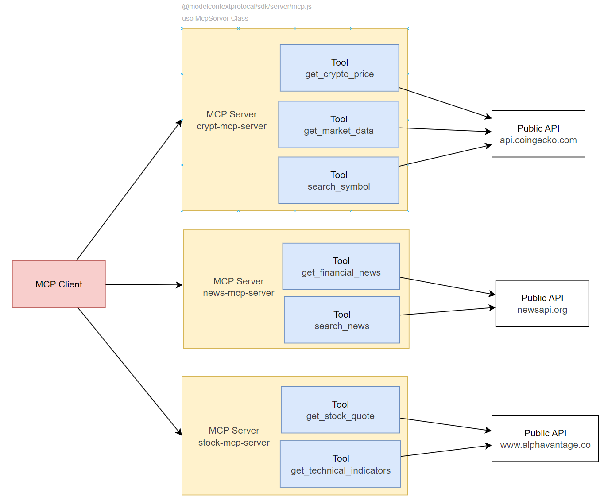

# Example of prototype using MCP with LangChainJS (cryptcurrency, stock price, news acquisition AI assistant)

[日本語](./docs/ja/README.md)

## Overview
This project provides access to cryptocurrency, stock market, and financial news data via multiple public APIs, wrapped as MCP (Model Context Protocol) servers. You can interact with these servers through natural language using an local LLM from a terminal-based client.

- The client communicates with an LLM via natural language commands.
- The servers fetch and format data from public APIs and return structured results.
- MCP server connection from LangChain and memory management by LangChain



---

## Technologies Used

- 🧠 [modelcontextprotocol/typescript-sdk](https://github.com/modelcontextprotocol/typescript-sdk): For implementing MCP servers
- 🔗 [LangChain MCP Adapter](https://github.com/langchain-ai/langchainjs/tree/main/libs/langchain-mcp-adapters): Integrates MCP tools with LangChainJS
- 📊 [LangSmith](https://www.langchain.com/langsmith): For tracing and debugging
- 💻 [Ollama (Qwen3:8b)](https://github.com/ollama/ollama): Local LLM runtime environment

---

## Directory Structure
```
src/
├── main.ts # Entry point
└── mcp/
├──── base-mcp-server.ts # Common MCP server logic
├──── crypto-server.ts # Cryptocurrency MCP (CoinGecko)
├──── news-server.ts # News MCP (NewsAPI)
└──── stock-server.ts # Stock MCP (Alpha Vantage)
```

---

## Public APIs Used

- [CoinGecko API](https://docs.coingecko.com/v3.0.1/reference/introduction)
- [News API](https://newsapi.org/docs)
- [Alpha Vantage API](https://www.alphavantage.co/documentation/)

---

## How to Run

### 1. Setup
```bash
npm install
```

### 2. Start Ollama (Local LLM)
Make sure Ollama is installed and start the Qwen3:8b model:
```bash
ollama run qwen3:8b
```

### 3. Set Environment Variables
Copy .env.example to .env and provide your API keys:
```bash
cp .env.example .env
```
> 🔑 You need to get your API keys from News API and Alpha Vantage.

### 4. Start MCP Servers
Launch all MCP servers locally using the launcher script:
```bash
npm run start-mcp-servers
```

### 5. Start the Client
Start the CLI client and interact with your LLM + MCP stack:
```bash
npm run dev
```