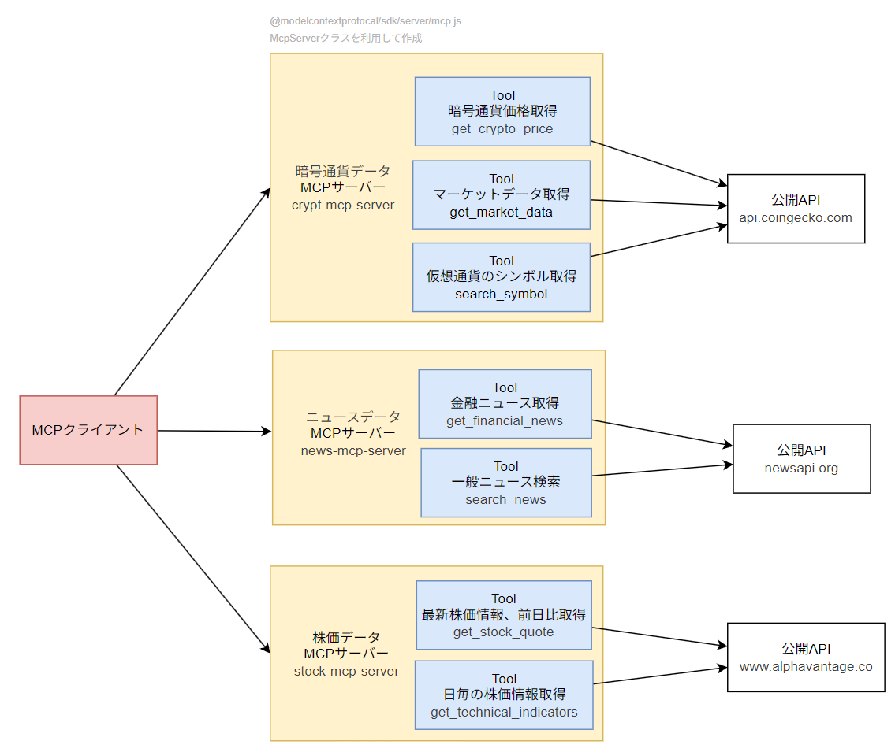

# LangChainJS × MCP の使用例（暗号通貨・株価・ニュース取得 AI アシスタント）

## 概要
暗号通貨、市場データ、金融ニュースなどの複数の公開APIから取得し、それらを Model Context Protocol（MCP）サーバーのツールとして登録しました。ターミナルベースのクライアントから自然言語を使って、ローカル上のLLMがツールを呼び出し回答します。

- クライアントは自然言語でLLMにアクセスします。
- MCPサーバーは公開APIからデータを取得し、構造化された結果を返します。
- LangChainによるメモリ管理を行います



---

## 使用技術

- 🧠 [modelcontextprotocol/typescript-sdk](https://github.com/modelcontextprotocol/typescript-sdk): MCPサーバーの実装用SDK
- 🔗 [LangChain MCP Adapter](https://github.com/langchain-ai/langchainjs/tree/main/libs/langchain-mcp-adapters): LangChainJSとの統合用アダプタ
- 📊 [LangSmith](https://www.langchain.com/langsmith): トレーシングとデバッグ用ツール
- 💻 [Ollama (Qwen3:8b)](https://github.com/ollama/ollama): ローカルでのLLM実行環境

---

## ディレクトリ構成
```
src/
├── main.ts # エントリーポイント
└── mcp/
├──── base-mcp-server.ts # MCP共通処理
├──── crypto-server.ts # 暗号通貨MCP（CoinGecko）
├──── news-server.ts # ニュースMCP（NewsAPI）
└──── stock-server.ts # 株価MCP（Alpha Vantage）
```

---

## 使用している公開API

- [CoinGecko API](https://docs.coingecko.com/v3.0.1/reference/introduction)
- [News API](https://newsapi.org/docs)
- [Alpha Vantage API](https://www.alphavantage.co/documentation/)

---

## 実行方法

### 1. セットアップ
```bash
npm install
```
### 2. Ollama（ローカルLLM）の起動
Ollamaがインストールされていることを確認し、Qwen3:8bモデルを起動します：
```bash
ollama run qwen3:8b
```

### 3. 環境変数の設定
.env.example を .env にコピーし、必要なAPIキーを設定します：
```bash
cp .env.example .env
```
> 🔑 News API と Alpha Vantage の公式サイトからAPIキーを取得してください。

### 4. MCPサーバーの起動
すべてのMCPサーバーをローカルで起動します：
```bash
npm run start-mcp-servers
```

### 5. クライアントの起動
CLIクライアントを起動し、LLM + MCPスタックと対話を開始します：
```bash
npm run dev
```